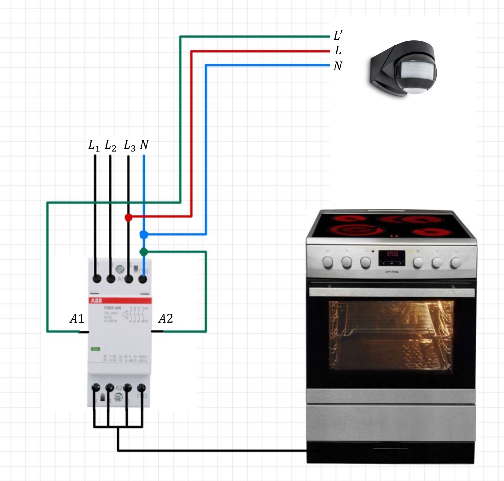

# Smart Stove Guard

Dieses Repository beschreibt den Aufbau einer Lösung zur automatischen Abschaltung für Küchengeräte wie z.B. Herde und Backöfen. Dies kann insbesondere bei älteren Menschen oder Personen mit Demenz sinnvoll sein, um die Brandgefahr zu minimieren. Ein Bewegungsmelder überwacht hierzu kontinuierlich die Anwesenheit im Küchenbereich. Wenn über einen definierten Zeitraum keine Bewegung erkannt wird, trennt ein Schütz die Stromversorgung des Geräts. Dadurch wird eine sichere und zuverlässige Nutzung von Küchengeräten gewährleistet, selbst wenn diese unbeaufsichtigt bleiben.

## Komponenten

- Bewegungsmelder mit einstellbarer Haltezeit und Schaltlogik (Schließer/Öffner)
- Schütz (z.B. ABB ESB25-40N 25A 240V Installationsschütz 4-polig)

## Funktionsweise & Installation

Der Bewegungsmelder hat einen Ausgang, der bei Detektion beschaltet wird. Verbindet man den Schaltausgang mit einem Mehrphasen-Schütz, kann dies die Netzspannung des Küchengerätes trennen. Zu beachten ist lediglich die Schaltlogik: Der Ausgang des Bewegungsmelders kann entweder als Normally Open (NO) oder Normally Closed (NC) konfiguriert sein. Dies bestimmt, ob das Schütz im Ruhezustand geöffnet oder geschlossen ist, und muss entsprechend angepasst werden.

Für eine einfache Nachrüstung empfiehlt sich ein Aufputz-Kleinverteiler, der unter dem Herd positioniert werden kann. Somit entfällt die Notwendigkeit, Wände zu öffnen. Das Schütz im Kleinverteiler wird lediglich auf der Kabelstrecke zwischen Herd und Wandanschluss installiert. Die Zuleitung des Bewegungsmelders kann beispielsweise über einen Aufputz-Kabelkanal realisiert werden.

Bitte beachten Sie, dass alle elektrischen Arbeiten von einem qualifizierten Elektriker durchgeführt werden müssen, um die Sicherheit und die Einhaltung der Vorschriften zu gewährleisten.

## Schaltplan

